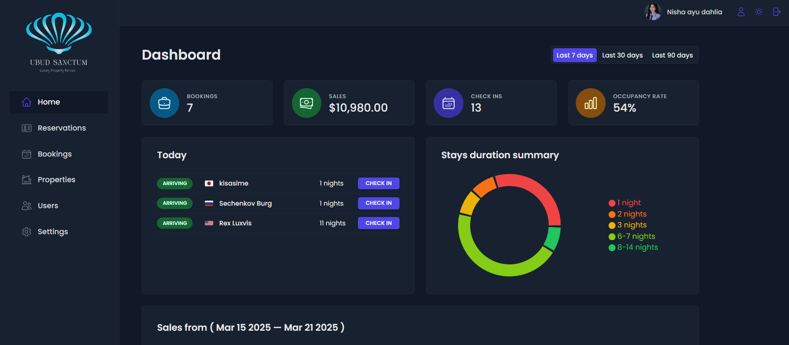

# 🌿 Ubud Sanctum – Platform Pemesanan Properti Modern



## 🏡 Tentang Ubud Sanctum

Ubud Sanctum adalah solusi digital inovatif untuk pemesanan dan manajemen **berbagai jenis properti** seperti hotel, vila, apartemen, dan guest house. Dibangun dengan teknologi modern seperti **React dan Supabase**, aplikasi ini menghadirkan pengalaman reservasi yang **cepat, efisien, dan mudah digunakan** bagi pemilik properti maupun pelanggan.

🔹 **Optimalkan manajemen properti Anda** dengan sistem berbasis cloud yang aman dan andal.
🔹 **Percepat proses reservasi** dengan antarmuka intuitif dan performa tinggi.
🔹 **Pantau data bisnis Anda** melalui dashboard analitik yang lengkap dan real-time.

🔗 **Coba Aplikasi Langsung:** [Ubud Sanctum Vercel](ubudsanctum.vercel.app)
🔗 **Coba Aplikasi Langsung:** [Ubud Sanctum Netlify](https://ubudsanctum.netlify.app)

## 🚀 Fitur Unggulan

✅ **Dashboard Analitik** – Lihat statistik pemesanan dan pendapatan dalam satu tampilan.
✅ **Manajemen Reservasi** – Tambahkan, perbarui, atau hapus pemesanan dengan mudah.
✅ **Sistem Check-in & Check-out** – Kelola tamu dengan cepat tanpa hambatan.
✅ **Pengelolaan Properti & Kamar** – Tambahkan, edit, dan kelola informasi properti dengan fleksibilitas tinggi.
✅ **Multi-User Management** – Atur hak akses admin untuk keamanan dan efisiensi operasional.
✅ **Konfigurasi Properti** – Sesuaikan harga, fasilitas, dan kebijakan pemesanan dengan mudah.

## 🛠 Teknologi di Balik Ubud Sanctum

Ubud Sanctum dibangun dengan **stack teknologi modern** yang memastikan **kecepatan, keamanan, dan skalabilitas tinggi**:

- **Frontend**: React, React Router, Styled Components
- **Backend**: Supabase
- **State Management**: TanStack React Query
- **Visualisasi Data**: Recharts
- **Notifikasi & UX Enhancements**: React Hot Toast, React Error Boundary
- **Linting & Code Quality**: ESLint
- **Build Tool**: Vite

## 🚀 Cara Instalasi & Mulai Menggunakan

### 1️⃣ Persyaratan

Pastikan Anda telah menginstal **Node.js** (versi terbaru disarankan) dan **npm** atau **yarn** di sistem Anda.

### 2️⃣ Instalasi

Ikuti langkah-langkah berikut untuk menjalankan proyek di lingkungan lokal:

1. **Clone repositori ini:**
   ```sh
   git clone https://github.com/Anntasena/PROJECT-Ubud-sanctum.git
   ```
2. **Masuk ke direktori proyek:**
   ```sh
   cd ubud-sanctum
   ```
3. **Instal dependencies:**
   ```sh
   npm install
   ```
4. **Siapkan file konfigurasi Supabase:**

   - Buat file `.env.local`
   - Tambahkan variabel Supabase sesuai dengan kredensial proyek Anda

5. **Jalankan proyek dalam mode pengembangan:**
   ```sh
   npm run dev
   ```
6. **Buka browser Anda dan akses:** `http://localhost:5173`

## 📜 Dependensi Utama

```json
{
  "dependencies": {
    "@supabase/supabase-js": "^2.48.1",
    "@tanstack/react-query": "^4.36.1",
    "@tanstack/react-query-devtools": "^4.36.1",
    "date-fns": "^4.1.0",
    "react": "^18.2.0",
    "react-dom": "^18.2.0",
    "react-error-boundary": "^5.0.0",
    "react-hook-form": "^7.54.2",
    "react-hot-toast": "^2.5.1",
    "react-icons": "^5.4.0",
    "react-router-dom": "^6.29.0",
    "recharts": "^2.15.1",
    "styled-components": "^6.1.15"
  }
}
```

---

✨ **Kelola properti Anda dengan lebih efisien dan modern bersama Ubud Sanctum!** ✨
